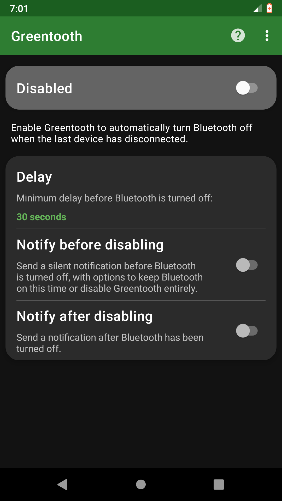

# Greentooth

This app disables Bluetooth automatically when the last Bluetooth device has
been disconnected.

This is a fork of the original Greentooth app developed by Nicklas Bergman at
<https://gitlab.com/nbergman/greentooth>.

Greentooth can help you save battery and mitigate the security risks of
Bluetooth by automatically turning Bluetooth off when it is no longer needed.
When the last Bluetooth device has disconnected Greentooth will wait for an
adjustable amount of time in order to not disturb any connection/reconnection
attempts and then deactivate Bluetooth.

Please note that Greentooth only runs upon device disconnection, it does not do
periodical checks for idle Bluetooth.

  
  

## Greentooth isn't working, what should I do?

1. Make sure that the app is enabled and that a reasonable delay is set.
2. Make sure that your Bluetooth device is actually disconnecting when you think
   it is and that there are no other Bluetooth devices left connected to your
   phone or tablet.
3. Your phone might be preventing Greentooth from launching when a Bluetooth
   device disconnect is detected. Try whitelisting the app/adding it to the
   "protected" list in your battery saver settings. Make sure it is allowed to
   launch from the background.

## License

This program is free software: you can redistribute it and/or modify it under
the terms of the GNU General Public License version 3 as published by the Free
Software Foundation.

This program is distributed in the hope that it will be useful, but WITHOUT ANY
WARRANTY; without even the implied warranty of MERCHANTABILITY or FITNESS FOR A
PARTICULAR PURPOSE. See the GNU General Public License for more details.

You should have received a copy of the GNU General Public License along with
this program. If not, see <https://www.gnu.org/licenses/>.
